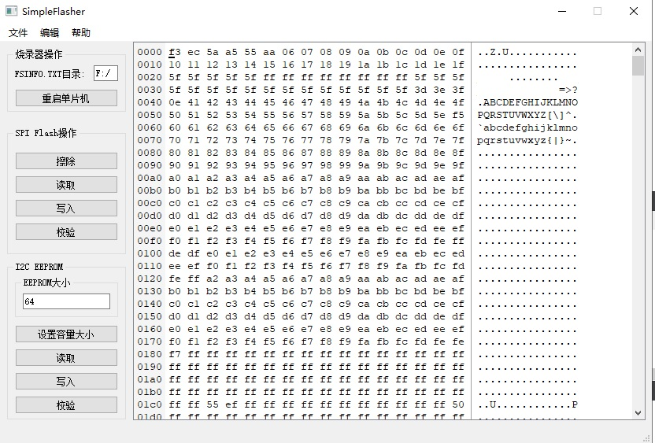
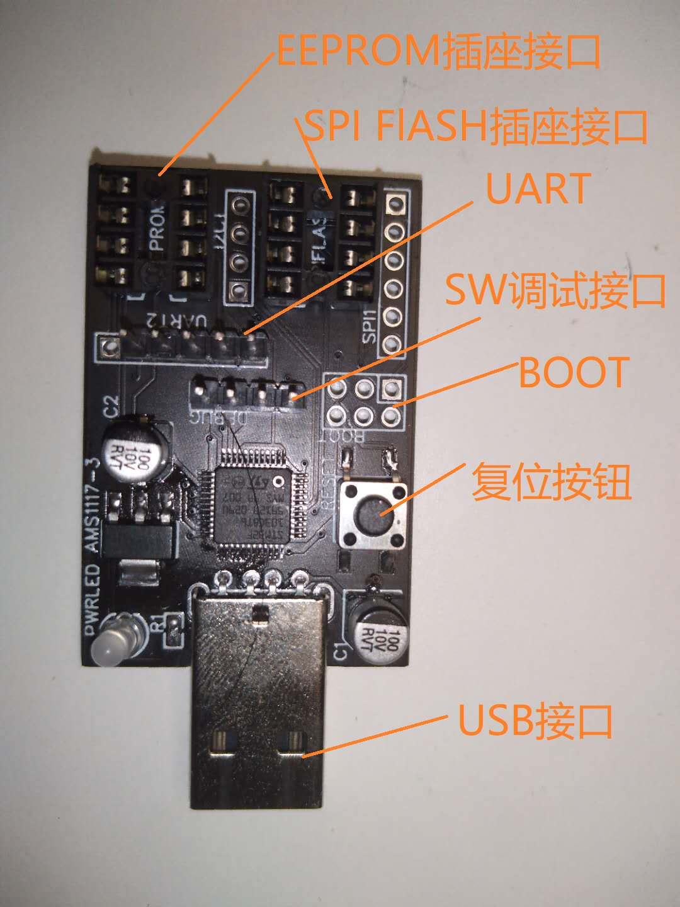
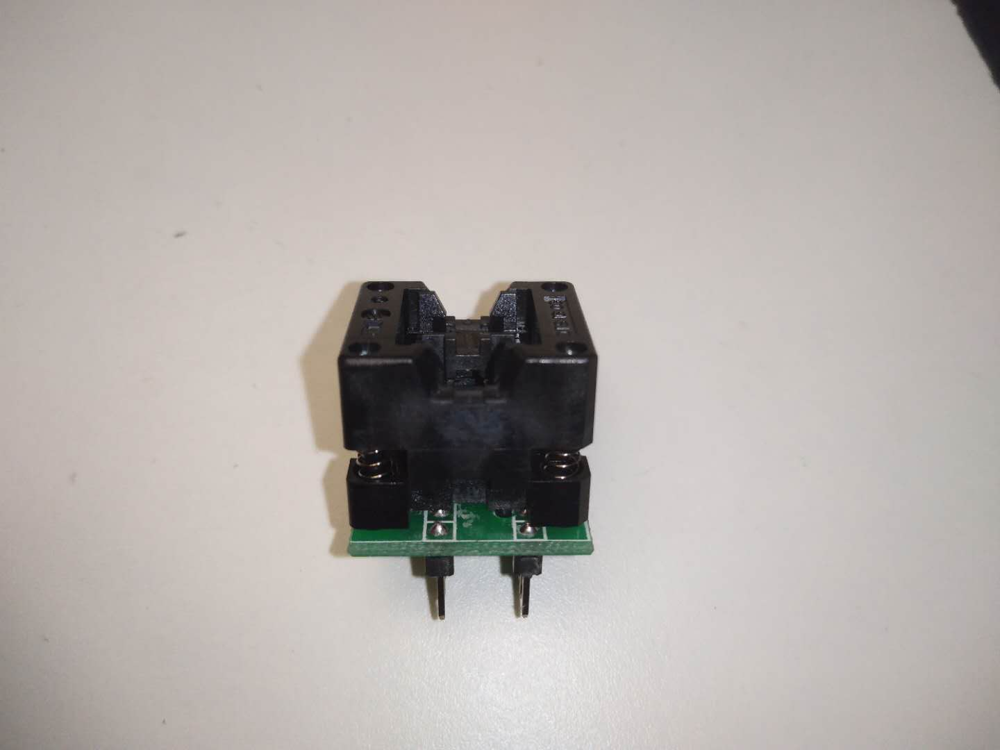
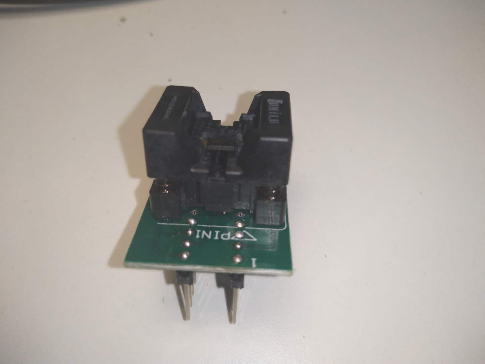

本工程为一个USB烧录器，主要功能为烧录SPI Flash和I2C EEPROM。对V1.0.0的固件进行了改进。修改如下:

* 删除了用于调试的附属功能

* 将USB CDC/ACM换为USB MASS STORAGE CLASS，加快读写速度

# 软件部分

采用[VirtualFat](https://github.com/HEYAHONG/STM32_VirtualFat.git),虚拟一个U盘，将SPI Flash和I2C EEPROM像普通文件一样读。当硬件连接正确且上位机正确识别U盘后，在U盘中会出现24XXX.bin与25XXX.bin,对这些文件的操作会映射到SPI Flash与I2C EEPROM上。

## 命令

由于读写SPI Flash和I2C EEPROM还需要一些额外的操作，如：EEPROM的设置容量，Flash的擦除操作。因此，还需要单独一个文件(FSINFO.TXT)用于执行这些命令。写入这个文件的操作会被解析并执行。当前支持的命令有：

* RESET 重启单片机
* FE    擦除Flash(Flash ERASE)
* E###  设置EEPROM容量为###Kbits（###为10进制数）

## 支持的操作系统

* windows

# 上位机部分

采用USB MASS STORAGE的烧录器其实可以不用上位机，直接靠复制文件即可完成读操作。写操作也只需要先把文件改名（和虚拟的U盘中的文件同名），在复制进去即可。不推荐直接打开虚拟的U盘文件内容，可能会造成卡顿。当待写入的文件大小与Flash或EEPROM不一致时，尤其是读写不能按512字节操作或待写入文件大小不是512的整倍数时，可能写入多余的0，此时这需要使用上位机软件在内部将数据对齐后写入。

# 硬件部分

硬件部分主要由一块带USB接口的主板和各种封装转DIP-8座组成。

注意:主板外形会随着PCB工艺，选择性焊接和硬件设计版本的不同而不同，但最主要的USB接口和插座接口均不会缺少。

由于有很多EEPROM和SPI Flash并不是DIP-8封装的，因此需要转接插座才能安装到主板上。

> SOP-8转DIP-8插座（主要用于安装w25q80）：

>> 

> TSSOP-8转DIP-8座(主要用于安装AT24C64)：

>> 

注意:芯片安装时，1脚的位置要正确，否则可能烧坏芯片（接反时，芯片电源和地会对调）
