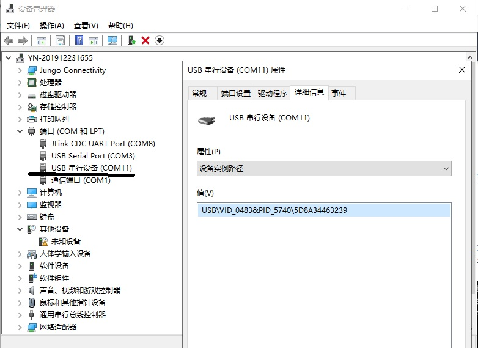
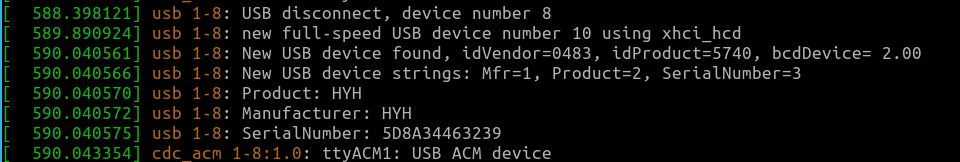

本工程为一个USB烧录器，主要功能为烧录SPI Flash和I2C EEPROM，也提供一些附属功能。

全部功能如下:

* 支持极其有限的USB转串口功能，用于调试。
* USB虚拟串口转SPI功能
* SPI Flash烧写功能（主要为w25q80及其兼容器件）
* USB虚拟串口转I2C
* I2C EEPROM烧写功能（主要为AT24C64及其兼容器件）

# 软件部分

在本工程中，USB被配置为虚拟串口功能(属于USB CDC)，一般情况下是免驱的，已测试平台：

* Windows 10
* ubuntu 19.04

当硬件被接入时，会自动安装通用驱动，在Windows 10下会分配一个串口号COMx(x为不固定的数字值)，在linux下会被udev自动分配到/dev/ttyACMx(x为不固定的数字值)。此时，便可以像操作普通串口设备一样操作硬件。

在本工程中通过上位机设置的串口参数区分不同的模式，模式区分如下：

* 串口模式：上位机设置的串口波特率小于1500000，用于有限的USB转串口功能。
* 原始模式SPI：上位机设置的串口波特率大于等于2000000且停止位设置为1位，提供原始的USB虚拟串口转SPI功能。
* 命令模式SPI：上位机设置的串口波特率大于等于2000000且停止位设置不为1位，此时上位机发送的数据将被解析，然后调用内置的函数通过SPI对Flash进行操作，可以提高读写速率。
* 原始模式I2C：上位机设置的串口波特率大于等于1500000小于2000000且停止位设置为1位，提供原始的USB虚拟串口转I2C功能。
* 命令模式I2C：上位机设置的串口波特率大于等于1500000小于2000000且停止位设置不为1位，此时上位机发送的数据将被解析，然后调用内置的函数通过I2C对EEPROM进行操作，可以提高读写速率。

当在串口助手上调试时，所有操作均需要在hex模式下进行，不能直接发送字符串。

## 串口模式

此时将会尽可能使用上位机对串口的设置(停止位、校验位、数据长度、波特率等)对UART2进行设置，上位机发送的数据将会直接从UART2发送，UART2接收的数据也将直接发送给上位机。

## 原始模式SPI

此时将会直接将从上位机接收的数据从SPI的MOSI发送出去，同时从MISO接收的数据也将直接返回给上位机。在一次通信中，上位机发送的数据长度应该为发送给SPI从器件的命令长度加上SPI从器件返回的数据长度，发送给上位机的长度同上位机发送的长度，上位机接收的数据前半部分是发送时从器件发送的数据(一般是无效的)，后半部分才是真正的有效数据。

## 命令模式SPI

上位机发送的数据将被解析，第一个字节将会被认为是命令号，硬件通过这个命令号执行不同的函数，出错时，返回的数据的第一个字节为0xff。

## 原始模式I2C

帧格式: I2C器件地址+待发送/接收的的数据，其中器件地址为8位地址(最低位表示读(1)/写(0)),待发送/接收的由帧长度-1的值确定。

>例：当使用I2C操作EEPROM AT24C64时，地址为A1（读）/A0(写)。

>> 进行读操作时，无需发送读取地址，自动从当前地址读帧长度-1个字符。需要改变地址时，需要使用写操作(不写入任何数据)。

>> 进行写操作时，除需要器件地址外，待发送的数据前2字节为写入/读取地址（地址高字节在前），后面才是实际写入的数据（长度为帧长度-3，当写入数据不存在时，仅改变地址）。注意：写入数据时，不会自动跨页，如需跨页，要分为多次写操作。

## 命令模式I2C

上位机发送的数据将被解析，第一个字节将会被认为是命令号，硬件通过这个命令号执行不同的函数，出错时，返回的数据的第一个字节为0xff。
