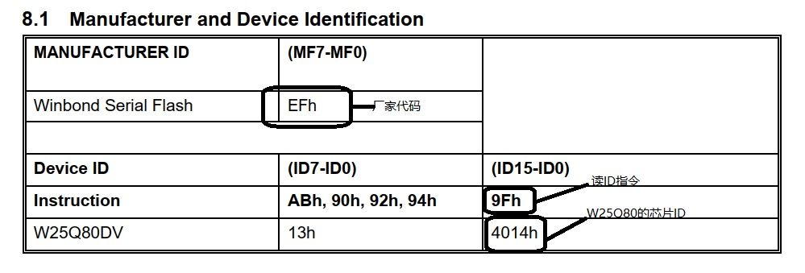
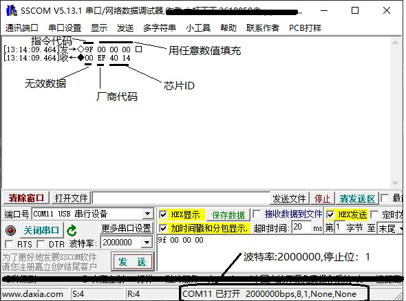
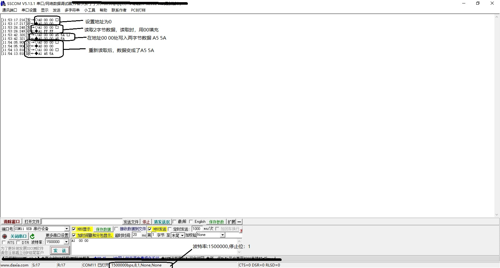
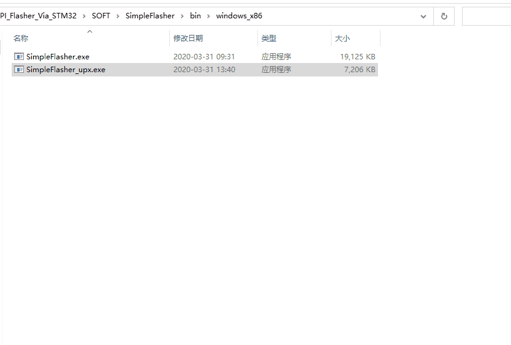
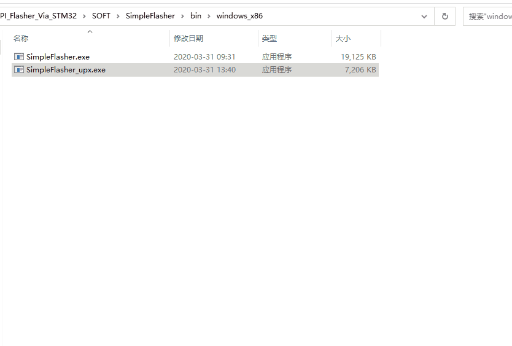

本工程为一个USB烧录器，主要功能为烧录SPI Flash和I2C EEPROM，也提供一些附属功能。

全部功能如下:

* 支持极其有限的USB转串口功能，用于调试。
* USB虚拟串口转SPI功能
* SPI Flash烧写功能（主要为w25q80及其兼容器件）
* USB虚拟串口转I2C
* I2C EEPROM烧写功能（主要为AT24C64及其兼容器件）

# 软件部分

在本工程中，USB被配置为虚拟串口功能(属于USB CDC)，一般情况下是免驱的，已测试平台：

* Windows 10
* ubuntu 19.04

当硬件被接入时，会自动安装通用驱动，在Windows 10下会分配一个串口号COMx(x为不固定的数字值)，在linux下会被udev自动分配到/dev/ttyACMx(x为不固定的数字值)。此时，便可以像操作普通串口设备一样操作硬件。

在本工程中通过上位机设置的串口参数区分不同的模式，模式区分如下：

* 串口模式：上位机设置的串口波特率小于1500000，用于有限的USB转串口功能。
* 原始模式SPI：上位机设置的串口波特率大于等于2000000且停止位设置为1位，提供原始的USB虚拟串口转SPI功能。
* 命令模式SPI：上位机设置的串口波特率大于等于2000000且停止位设置不为1位，此时上位机发送的数据将被解析，然后调用内置的函数通过SPI对Flash进行操作，可以提高读写速率。
* 原始模式I2C：上位机设置的串口波特率大于等于1500000小于2000000且停止位设置为1位，提供原始的USB虚拟串口转I2C功能。
* 命令模式I2C：上位机设置的串口波特率大于等于1500000小于2000000且停止位设置不为1位，此时上位机发送的数据将被解析，然后调用内置的函数通过I2C对EEPROM进行操作，可以提高读写速率。

当在串口助手上调试时，所有操作均需要在hex模式下进行，不能直接发送字符串。

## 串口模式

此时将会尽可能使用上位机对串口的设置(停止位、校验位、数据长度、波特率等)对UART2进行设置，上位机发送的数据将会直接从UART2发送，UART2接收的数据也将直接发送给上位机。

## 原始模式SPI

此时将会直接将从上位机接收的数据从SPI的MOSI发送出去，同时从MISO接收的数据也将直接返回给上位机。在一次通信中，上位机发送的数据长度应该为发送给SPI从器件的命令长度加上SPI从器件返回的数据长度，发送给上位机的长度同上位机发送的长度，上位机接收的数据前半部分是发送时从器件发送的数据(一般是无效的)，后半部分才是真正的有效数据。

> 例: SPI Flash可以通过读芯片ID判断容量，发送9f，将返回3字节（包含厂商代码和芯片ID）.

>> 

>> 

## 命令模式SPI

上位机发送的数据将被解析，第一个字节将会被认为是命令号，硬件通过这个命令号执行不同的函数，出错时，返回的数据的第一个字节为0xff。

<table border=0 cellpadding=0 cellspacing=0 width=1663 class=xl6328029
 style='border-collapse:collapse;table-layout:fixed;width:1250pt'>
 <col class=xl6328029 width=72 style='width:54pt'>
 <col class=xl6328029 width=61 style='mso-width-source:userset;mso-width-alt:
 1952;width:46pt'>
 <col class=xl6328029 width=269 style='mso-width-source:userset;mso-width-alt:
 8608;width:202pt'>
 <col class=xl6328029 width=66 style='mso-width-source:userset;mso-width-alt:
 2112;width:50pt'>
 <col class=xl6328029 width=290 style='mso-width-source:userset;mso-width-alt:
 9280;width:218pt'>
 <col class=xl6328029 width=74 style='mso-width-source:userset;mso-width-alt:
 2368;width:56pt'>
 <col class=xl6328029 width=250 style='mso-width-source:userset;mso-width-alt:
 8000;width:188pt'>
 <col class=xl6328029 width=72 span=2 style='width:54pt'>
 <col class=xl6328029 width=126 style='mso-width-source:userset;mso-width-alt:
 4032;width:95pt'>
 <col class=xl6328029 width=311 style='mso-width-source:userset;mso-width-alt:
 9952;width:233pt'>
 <tr height=36 style='mso-height-source:userset;height:27.0pt'>
  <td colspan=11 height=36 class=xl6528029 width=1663 style='border-right:.5pt solid black;
  height:27.0pt;width:1250pt'>Mode_SPI_CMD表</td>
 </tr>
 <tr height=17 style='mso-height-source:userset;height:12.75pt'>
  <td colspan=11 height=17 class=xl6828029 style='border-right:.5pt solid black;
  height:12.75pt'>注意:串口发送数据长度大于64字节时将不稳定</td>
 </tr>
 <tr height=35 style='mso-height-source:userset;height:26.25pt'>
  <td rowspan=2 height=73 class=xl6428029 style='height:54.75pt;border-top:
  none'>命令号</td>
  <td colspan=2 class=xl6428029 style='border-left:none'>参数1</td>
  <td colspan=2 class=xl6428029 style='border-left:none'>参数2</td>
  <td colspan=2 class=xl6428029 style='border-left:none'>参数3</td>
  <td colspan=2 class=xl6428029 style='border-left:none'>参数4</td>
  <td rowspan=2 class=xl6428029 style='border-top:none'>成功返回长度</td>
  <td rowspan=2 class=xl6428029 style='border-top:none'>说明</td>
 </tr>
 <tr height=38 style='mso-height-source:userset;height:28.5pt'>
  <td height=38 class=xl6428029 style='height:28.5pt;border-top:none;
  border-left:none'>占用长度</td>
  <td class=xl6428029 style='border-top:none;border-left:none'>说明</td>
  <td class=xl6428029 style='border-top:none;border-left:none'>占用长度</td>
  <td class=xl6428029 style='border-top:none;border-left:none'>说明</td>
  <td class=xl6428029 style='border-top:none;border-left:none'>占用长度</td>
  <td class=xl6428029 style='border-top:none;border-left:none'>说明</td>
  <td class=xl6428029 style='border-top:none;border-left:none'>占用长度</td>
  <td class=xl6428029 style='border-top:none;border-left:none'>说明</td>
 </tr>
 <tr height=22 style='mso-height-source:userset;height:16.5pt'>
  <td height=22 class=xl7128029 width=72 style='height:16.5pt;border-top:none;
  width:54pt'>0</td>
  <td class=xl7128029 width=61 style='border-top:none;border-left:none;
  width:46pt'>1</td>
  <td class=xl7128029 width=269 style='border-top:none;border-left:none;
  width:202pt'>CPOL,为0时为SPI_POLARITY_LOW</td>
  <td class=xl7128029 width=66 style='border-top:none;border-left:none;
  width:50pt'>1</td>
  <td class=xl7128029 width=290 style='border-top:none;border-left:none;
  width:218pt'>CPHA，为0时为SPI_PHASE_1EDGE</td>
  <td class=xl7128029 width=74 style='border-top:none;border-left:none;
  width:56pt'>1</td>
  <td class=xl7128029 width=250 style='border-top:none;border-left:none;
  width:188pt'>位序，为0时为SPI_FIRSTBIT_MSB</td>
  <td class=xl7128029 width=72 style='border-top:none;border-left:none;
  width:54pt'>　</td>
  <td class=xl7128029 width=72 style='border-top:none;border-left:none;
  width:54pt'>　</td>
  <td class=xl7128029 width=126 style='border-top:none;border-left:none;
  width:95pt'>同发送长度</td>
  <td class=xl7128029 width=311 style='border-top:none;border-left:none;
  width:233pt'>设置SPI通信参数</td>
 </tr>
 <tr height=38 style='height:28.5pt'>
  <td height=38 class=xl7128029 width=72 style='height:28.5pt;border-top:none;
  width:54pt'>1</td>
  <td class=xl7128029 width=61 style='border-top:none;border-left:none;
  width:46pt'>　</td>
  <td class=xl7128029 width=269 style='border-top:none;border-left:none;
  width:202pt'>　</td>
  <td class=xl7128029 width=66 style='border-top:none;border-left:none;
  width:50pt'>　</td>
  <td class=xl7128029 width=290 style='border-top:none;border-left:none;
  width:218pt'>　</td>
  <td class=xl7128029 width=74 style='border-top:none;border-left:none;
  width:56pt'>　</td>
  <td class=xl7128029 width=250 style='border-top:none;border-left:none;
  width:188pt'>　</td>
  <td class=xl7128029 width=72 style='border-top:none;border-left:none;
  width:54pt'>　</td>
  <td class=xl7128029 width=72 style='border-top:none;border-left:none;
  width:54pt'>　</td>
  <td class=xl7128029 width=126 style='border-top:none;border-left:none;
  width:95pt'>1+40</td>
  <td class=xl7128029 width=311 style='border-top:none;border-left:none;
  width:233pt'>初始化SPI Flash通信，读写/擦除前必须执行此命令，返回的数据为配置结构体的内容。</td>
 </tr>
 <tr height=19 style='height:14.25pt'>
  <td height=19 class=xl7128029 width=72 style='height:14.25pt;border-top:none;
  width:54pt'>2</td>
  <td class=xl7128029 width=61 style='border-top:none;border-left:none;
  width:46pt'>　</td>
  <td class=xl7128029 width=269 style='border-top:none;border-left:none;
  width:202pt'>　</td>
  <td class=xl7128029 width=66 style='border-top:none;border-left:none;
  width:50pt'>　</td>
  <td class=xl7128029 width=290 style='border-top:none;border-left:none;
  width:218pt'>　</td>
  <td class=xl7128029 width=74 style='border-top:none;border-left:none;
  width:56pt'>　</td>
  <td class=xl7128029 width=250 style='border-top:none;border-left:none;
  width:188pt'>　</td>
  <td class=xl7128029 width=72 style='border-top:none;border-left:none;
  width:54pt'>　</td>
  <td class=xl7128029 width=72 style='border-top:none;border-left:none;
  width:54pt'>　</td>
  <td class=xl7128029 width=126 style='border-top:none;border-left:none;
  width:95pt'>同发送长度</td>
  <td class=xl7128029 width=311 style='border-top:none;border-left:none;
  width:233pt'>擦除整个SPI Flash芯片，W25qxx_EraseChip</td>
 </tr>
 <tr height=19 style='height:14.25pt'>
  <td height=19 class=xl7128029 width=72 style='height:14.25pt;border-top:none;
  width:54pt'>3</td>
  <td class=xl7128029 width=61 style='border-top:none;border-left:none;
  width:46pt'>4</td>
  <td class=xl7128029 width=269 style='border-top:none;border-left:none;
  width:202pt'>扇区地址，小端模式</td>
  <td class=xl7128029 width=66 style='border-top:none;border-left:none;
  width:50pt'>　</td>
  <td class=xl7128029 width=290 style='border-top:none;border-left:none;
  width:218pt'>　</td>
  <td class=xl7128029 width=74 style='border-top:none;border-left:none;
  width:56pt'>　</td>
  <td class=xl7128029 width=250 style='border-top:none;border-left:none;
  width:188pt'>　</td>
  <td class=xl7128029 width=72 style='border-top:none;border-left:none;
  width:54pt'>　</td>
  <td class=xl7128029 width=72 style='border-top:none;border-left:none;
  width:54pt'>　</td>
  <td class=xl7128029 width=126 style='border-top:none;border-left:none;
  width:95pt'>同发送长度</td>
  <td class=xl7128029 width=311 style='border-top:none;border-left:none;
  width:233pt'>按扇区擦除SPI Flash芯片,W25qxx_EraseSector</td>
 </tr>
 <tr height=19 style='height:14.25pt'>
  <td height=19 class=xl7128029 width=72 style='height:14.25pt;border-top:none;
  width:54pt'>4</td>
  <td class=xl7128029 width=61 style='border-top:none;border-left:none;
  width:46pt'>4</td>
  <td class=xl7128029 width=269 style='border-top:none;border-left:none;
  width:202pt'>块地址，小端模式</td>
  <td class=xl7128029 width=66 style='border-top:none;border-left:none;
  width:50pt'>　</td>
  <td class=xl7128029 width=290 style='border-top:none;border-left:none;
  width:218pt'>　</td>
  <td class=xl7128029 width=74 style='border-top:none;border-left:none;
  width:56pt'>　</td>
  <td class=xl7128029 width=250 style='border-top:none;border-left:none;
  width:188pt'>　</td>
  <td class=xl7128029 width=72 style='border-top:none;border-left:none;
  width:54pt'>　</td>
  <td class=xl7128029 width=72 style='border-top:none;border-left:none;
  width:54pt'>　</td>
  <td class=xl7128029 width=126 style='border-top:none;border-left:none;
  width:95pt'>同发送长度</td>
  <td class=xl7128029 width=311 style='border-top:none;border-left:none;
  width:233pt'>按块擦除SPI Flash芯片,W25qxx_EraseBlock</td>
 </tr>
 <tr height=19 style='height:14.25pt'>
  <td height=19 class=xl7128029 width=72 style='height:14.25pt;border-top:none;
  width:54pt'>5</td>
  <td class=xl7128029 width=61 style='border-top:none;border-left:none;
  width:46pt'>4</td>
  <td class=xl7128029 width=269 style='border-top:none;border-left:none;
  width:202pt'>地址，小端模式</td>
  <td class=xl7128029 width=66 style='border-top:none;border-left:none;
  width:50pt'>4</td>
  <td class=xl7128029 width=290 style='border-top:none;border-left:none;
  width:218pt'>偏移，小端模式</td>
  <td class=xl7128029 width=74 style='border-top:none;border-left:none;
  width:56pt'>4</td>
  <td class=xl7128029 width=250 style='border-top:none;border-left:none;
  width:188pt'>数量，小端模式</td>
  <td class=xl7128029 width=72 style='border-top:none;border-left:none;
  width:54pt'>　</td>
  <td class=xl7128029 width=72 style='border-top:none;border-left:none;
  width:54pt'>　</td>
  <td class=xl7128029 width=126 style='border-top:none;border-left:none;
  width:95pt'>同发送长度</td>
  <td class=xl7128029 width=311 style='border-top:none;border-left:none;
  width:233pt'>检查页是否为空，,W25qxx_IsEmptyPage</td>
 </tr>
 <tr height=19 style='height:14.25pt'>
  <td height=19 class=xl7128029 width=72 style='height:14.25pt;border-top:none;
  width:54pt'>6</td>
  <td class=xl7128029 width=61 style='border-top:none;border-left:none;
  width:46pt'>4</td>
  <td class=xl7128029 width=269 style='border-top:none;border-left:none;
  width:202pt'>地址，小端模式</td>
  <td class=xl7128029 width=66 style='border-top:none;border-left:none;
  width:50pt'>4</td>
  <td class=xl7128029 width=290 style='border-top:none;border-left:none;
  width:218pt'>偏移，小端模式</td>
  <td class=xl7128029 width=74 style='border-top:none;border-left:none;
  width:56pt'>4</td>
  <td class=xl7128029 width=250 style='border-top:none;border-left:none;
  width:188pt'>数量，小端模式</td>
  <td class=xl7128029 width=72 style='border-top:none;border-left:none;
  width:54pt'>　</td>
  <td class=xl7128029 width=72 style='border-top:none;border-left:none;
  width:54pt'>　</td>
  <td class=xl7128029 width=126 style='border-top:none;border-left:none;
  width:95pt'>同发送长度</td>
  <td class=xl7128029 width=311 style='border-top:none;border-left:none;
  width:233pt'>检查扇区是否为空W25qxx_IsEmptySector</td>
 </tr>
 <tr height=19 style='height:14.25pt'>
  <td height=19 class=xl7128029 width=72 style='height:14.25pt;border-top:none;
  width:54pt'>7</td>
  <td class=xl7128029 width=61 style='border-top:none;border-left:none;
  width:46pt'>4</td>
  <td class=xl7128029 width=269 style='border-top:none;border-left:none;
  width:202pt'>地址，小端模式</td>
  <td class=xl7128029 width=66 style='border-top:none;border-left:none;
  width:50pt'>4</td>
  <td class=xl7128029 width=290 style='border-top:none;border-left:none;
  width:218pt'>偏移，小端模式</td>
  <td class=xl7128029 width=74 style='border-top:none;border-left:none;
  width:56pt'>4</td>
  <td class=xl7128029 width=250 style='border-top:none;border-left:none;
  width:188pt'>数量，小端模式</td>
  <td class=xl7128029 width=72 style='border-top:none;border-left:none;
  width:54pt'>　</td>
  <td class=xl7128029 width=72 style='border-top:none;border-left:none;
  width:54pt'>　</td>
  <td class=xl7128029 width=126 style='border-top:none;border-left:none;
  width:95pt'>同发送长度</td>
  <td class=xl7128029 width=311 style='border-top:none;border-left:none;
  width:233pt'>检查块是否为空，W25qxx_IsEmptyBlock</td>
 </tr>
 <tr height=19 style='height:14.25pt'>
  <td height=19 class=xl7128029 width=72 style='height:14.25pt;border-top:none;
  width:54pt'>8</td>
  <td class=xl7128029 width=61 style='border-top:none;border-left:none;
  width:46pt'>4</td>
  <td class=xl7128029 width=269 style='border-top:none;border-left:none;
  width:202pt'>地址，小端模式</td>
  <td class=xl7128029 width=66 style='border-top:none;border-left:none;
  width:50pt'>1</td>
  <td class=xl7128029 width=290 style='border-top:none;border-left:none;
  width:218pt'>待写入的数据</td>
  <td class=xl7128029 width=74 style='border-top:none;border-left:none;
  width:56pt'>　</td>
  <td class=xl7128029 width=250 style='border-top:none;border-left:none;
  width:188pt'>　</td>
  <td class=xl7128029 width=72 style='border-top:none;border-left:none;
  width:54pt'>　</td>
  <td class=xl7128029 width=72 style='border-top:none;border-left:none;
  width:54pt'>　</td>
  <td class=xl7128029 width=126 style='border-top:none;border-left:none;
  width:95pt'>同发送长度</td>
  <td class=xl7128029 width=311 style='border-top:none;border-left:none;
  width:233pt'>写入1字节数据，W25qxx_WriteByte</td>
 </tr>
 <tr height=19 style='height:14.25pt'>
  <td height=19 class=xl7128029 width=72 style='height:14.25pt;border-top:none;
  width:54pt'>9</td>
  <td class=xl7128029 width=61 style='border-top:none;border-left:none;
  width:46pt'>4</td>
  <td class=xl7128029 width=269 style='border-top:none;border-left:none;
  width:202pt'>地址，小端模式</td>
  <td class=xl7128029 width=66 style='border-top:none;border-left:none;
  width:50pt'>4</td>
  <td class=xl7128029 width=290 style='border-top:none;border-left:none;
  width:218pt'>偏移，小端模式</td>
  <td class=xl7128029 width=74 style='border-top:none;border-left:none;
  width:56pt'>至帧结束</td>
  <td class=xl7128029 width=250 style='border-top:none;border-left:none;
  width:188pt'>待写入的数据</td>
  <td class=xl7128029 width=72 style='border-top:none;border-left:none;
  width:54pt'>　</td>
  <td class=xl7128029 width=72 style='border-top:none;border-left:none;
  width:54pt'>　</td>
  <td class=xl7128029 width=126 style='border-top:none;border-left:none;
  width:95pt'>同发送长度</td>
  <td class=xl7128029 width=311 style='border-top:none;border-left:none;
  width:233pt'>按页写入数据，W25qxx_WritePage</td>
 </tr>
 <tr height=19 style='height:14.25pt'>
  <td height=19 class=xl7128029 width=72 style='height:14.25pt;border-top:none;
  width:54pt'>10</td>
  <td class=xl7128029 width=61 style='border-top:none;border-left:none;
  width:46pt'>4</td>
  <td class=xl7128029 width=269 style='border-top:none;border-left:none;
  width:202pt'>地址，小端模式</td>
  <td class=xl7128029 width=66 style='border-top:none;border-left:none;
  width:50pt'>4</td>
  <td class=xl7128029 width=290 style='border-top:none;border-left:none;
  width:218pt'>偏移，小端模式</td>
  <td class=xl7128029 width=74 style='border-top:none;border-left:none;
  width:56pt'>至帧结束</td>
  <td class=xl7128029 width=250 style='border-top:none;border-left:none;
  width:188pt'>待写入的数据</td>
  <td class=xl7128029 width=72 style='border-top:none;border-left:none;
  width:54pt'>　</td>
  <td class=xl7128029 width=72 style='border-top:none;border-left:none;
  width:54pt'>　</td>
  <td class=xl7128029 width=126 style='border-top:none;border-left:none;
  width:95pt'>同发送长度</td>
  <td class=xl7128029 width=311 style='border-top:none;border-left:none;
  width:233pt'>按扇区写入数据，W25qxx_WriteSector</td>
 </tr>
 <tr height=19 style='height:14.25pt'>
  <td height=19 class=xl7128029 width=72 style='height:14.25pt;border-top:none;
  width:54pt'>11</td>
  <td class=xl7128029 width=61 style='border-top:none;border-left:none;
  width:46pt'>4</td>
  <td class=xl7128029 width=269 style='border-top:none;border-left:none;
  width:202pt'>地址，小端模式</td>
  <td class=xl7128029 width=66 style='border-top:none;border-left:none;
  width:50pt'>4</td>
  <td class=xl7128029 width=290 style='border-top:none;border-left:none;
  width:218pt'>偏移，小端模式</td>
  <td class=xl7128029 width=74 style='border-top:none;border-left:none;
  width:56pt'>至帧结束</td>
  <td class=xl7128029 width=250 style='border-top:none;border-left:none;
  width:188pt'>待写入的数据</td>
  <td class=xl7128029 width=72 style='border-top:none;border-left:none;
  width:54pt'>　</td>
  <td class=xl7128029 width=72 style='border-top:none;border-left:none;
  width:54pt'>　</td>
  <td class=xl7128029 width=126 style='border-top:none;border-left:none;
  width:95pt'>同发送长度</td>
  <td class=xl7128029 width=311 style='border-top:none;border-left:none;
  width:233pt'>按块写入数据，W25qxx_WriteBlock</td>
 </tr>
 <tr height=38 style='height:28.5pt'>
  <td height=38 class=xl7128029 width=72 style='height:28.5pt;border-top:none;
  width:54pt'>12</td>
  <td class=xl7128029 width=61 style='border-top:none;border-left:none;
  width:46pt'>4</td>
  <td class=xl7128029 width=269 style='border-top:none;border-left:none;
  width:202pt'>地址，小端模式</td>
  <td class=xl7128029 width=66 style='border-top:none;border-left:none;
  width:50pt'>　</td>
  <td class=xl7128029 width=290 style='border-top:none;border-left:none;
  width:218pt'>　</td>
  <td class=xl7128029 width=74 style='border-top:none;border-left:none;
  width:56pt'>　</td>
  <td class=xl7128029 width=250 style='border-top:none;border-left:none;
  width:188pt'>　</td>
  <td class=xl7128029 width=72 style='border-top:none;border-left:none;
  width:54pt'>　</td>
  <td class=xl7128029 width=72 style='border-top:none;border-left:none;
  width:54pt'>　</td>
  <td class=xl7128029 width=126 style='border-top:none;border-left:none;
  width:95pt'>5+1</td>
  <td class=xl7128029 width=311 style='border-top:none;border-left:none;
  width:233pt'>读取1字节数据，数据在末尾，W25qxx_ReadByte</td>
 </tr>
 <tr height=38 style='height:28.5pt'>
  <td height=38 class=xl7128029 width=72 style='height:28.5pt;border-top:none;
  width:54pt'>13</td>
  <td class=xl7128029 width=61 style='border-top:none;border-left:none;
  width:46pt'>4</td>
  <td class=xl7128029 width=269 style='border-top:none;border-left:none;
  width:202pt'>地址，小端模式</td>
  <td class=xl7128029 width=66 style='border-top:none;border-left:none;
  width:50pt'>4</td>
  <td class=xl7128029 width=290 style='border-top:none;border-left:none;
  width:218pt'>数量，小端模式</td>
  <td class=xl7128029 width=74 style='border-top:none;border-left:none;
  width:56pt'>　</td>
  <td class=xl7128029 width=250 style='border-top:none;border-left:none;
  width:188pt'>　</td>
  <td class=xl7128029 width=72 style='border-top:none;border-left:none;
  width:54pt'>　</td>
  <td class=xl7128029 width=72 style='border-top:none;border-left:none;
  width:54pt'>　</td>
  <td class=xl7128029 width=126 style='border-top:none;border-left:none;
  width:95pt'>9+参数2</td>
  <td class=xl7128029 width=311 style='border-top:none;border-left:none;
  width:233pt'>读取多字节数据，数据在末尾，W26qxx_ReadBytes</td>
 </tr>
 <tr height=38 style='height:28.5pt'>
  <td height=38 class=xl7128029 width=72 style='height:28.5pt;border-top:none;
  width:54pt'>14</td>
  <td class=xl7128029 width=61 style='border-top:none;border-left:none;
  width:46pt'>4</td>
  <td class=xl7128029 width=269 style='border-top:none;border-left:none;
  width:202pt'>地址，小端模式</td>
  <td class=xl7128029 width=66 style='border-top:none;border-left:none;
  width:50pt'>4</td>
  <td class=xl7128029 width=290 style='border-top:none;border-left:none;
  width:218pt'>偏移，小端模式</td>
  <td class=xl7128029 width=74 style='border-top:none;border-left:none;
  width:56pt'>4</td>
  <td class=xl7128029 width=250 style='border-top:none;border-left:none;
  width:188pt'>数量，小端模式</td>
  <td class=xl7128029 width=72 style='border-top:none;border-left:none;
  width:54pt'>　</td>
  <td class=xl7128029 width=72 style='border-top:none;border-left:none;
  width:54pt'>　</td>
  <td class=xl7128029 width=126 style='border-top:none;border-left:none;
  width:95pt'>13+参数3</td>
  <td class=xl7128029 width=311 style='border-top:none;border-left:none;
  width:233pt'>按页读多字节数据，数据在末尾，W25qxx_ReadPage</td>
 </tr>
 <tr height=38 style='height:28.5pt'>
  <td height=38 class=xl7128029 width=72 style='height:28.5pt;border-top:none;
  width:54pt'>15</td>
  <td class=xl7128029 width=61 style='border-top:none;border-left:none;
  width:46pt'>4</td>
  <td class=xl7128029 width=269 style='border-top:none;border-left:none;
  width:202pt'>地址，小端模式</td>
  <td class=xl7128029 width=66 style='border-top:none;border-left:none;
  width:50pt'>4</td>
  <td class=xl7128029 width=290 style='border-top:none;border-left:none;
  width:218pt'>偏移，小端模式</td>
  <td class=xl7128029 width=74 style='border-top:none;border-left:none;
  width:56pt'>4</td>
  <td class=xl7128029 width=250 style='border-top:none;border-left:none;
  width:188pt'>数量，小端模式</td>
  <td class=xl7128029 width=72 style='border-top:none;border-left:none;
  width:54pt'>　</td>
  <td class=xl7128029 width=72 style='border-top:none;border-left:none;
  width:54pt'>　</td>
  <td class=xl7128029 width=126 style='border-top:none;border-left:none;
  width:95pt'>13+参数3</td>
  <td class=xl7128029 width=311 style='border-top:none;border-left:none;
  width:233pt'>按扇区读多字节数据，数据在末尾，W25qxx_ReadSector</td>
 </tr>
 <tr height=38 style='height:28.5pt'>
  <td height=38 class=xl7128029 width=72 style='height:28.5pt;border-top:none;
  width:54pt'>16</td>
  <td class=xl7128029 width=61 style='border-top:none;border-left:none;
  width:46pt'>4</td>
  <td class=xl7128029 width=269 style='border-top:none;border-left:none;
  width:202pt'>地址，小端模式</td>
  <td class=xl7128029 width=66 style='border-top:none;border-left:none;
  width:50pt'>4</td>
  <td class=xl7128029 width=290 style='border-top:none;border-left:none;
  width:218pt'>偏移，小端模式</td>
  <td class=xl7128029 width=74 style='border-top:none;border-left:none;
  width:56pt'>4</td>
  <td class=xl7128029 width=250 style='border-top:none;border-left:none;
  width:188pt'>数量，小端模式</td>
  <td class=xl7128029 width=72 style='border-top:none;border-left:none;
  width:54pt'>　</td>
  <td class=xl7128029 width=72 style='border-top:none;border-left:none;
  width:54pt'>　</td>
  <td class=xl7128029 width=126 style='border-top:none;border-left:none;
  width:95pt'>13+参数3</td>
  <td class=xl7128029 width=311 style='border-top:none;border-left:none;
  width:233pt'>按块读多字节数据，数据在末尾，W25qxx_ReadBlock</td>
 </tr>
 <![if supportMisalignedColumns]>
 <tr height=0 style='display:none'>
  <td width=72 style='width:54pt'></td>
  <td width=61 style='width:46pt'></td>
  <td width=269 style='width:202pt'></td>
  <td width=66 style='width:50pt'></td>
  <td width=290 style='width:218pt'></td>
  <td width=74 style='width:56pt'></td>
  <td width=250 style='width:188pt'></td>
  <td width=72 style='width:54pt'></td>
  <td width=72 style='width:54pt'></td>
  <td width=126 style='width:95pt'></td>
  <td width=311 style='width:233pt'></td>
 </tr>
 <![endif]>
</table>

## 原始模式I2C

帧格式: I2C器件地址+待发送/接收的的数据，其中器件地址为8位地址(最低位表示读(1)/写(0)),待发送/接收的由帧长度-1的值确定。

>例：当使用I2C操作EEPROM AT24C64时，地址为A1（读）/A0(写)。

>> 进行读操作时，无需发送读取地址，自动从当前地址读帧长度-1个字符。需要改变地址时，需要使用写操作(不写入任何数据)。

>> 进行写操作时，除需要器件地址外，待发送的数据前2字节为写入/读取地址（地址高字节在前），后面才是实际写入的数据（长度为帧长度-3，当写入数据不存在时，仅改变地址）。注意：写入数据时，不会自动跨页，如需跨页，要分为多次写操作。

## 命令模式I2C

上位机发送的数据将被解析，第一个字节将会被认为是命令号，硬件通过这个命令号执行不同的函数，出错时，返回的数据的第一个字节为0xff。

<table border=0 cellpadding=0 cellspacing=0 width=1457 class=xl6328029
 style='border-collapse:collapse;table-layout:fixed;width:1094pt'>
 <col class=xl6328029 width=72 style='width:54pt'>
 <col class=xl6328029 width=74 style='mso-width-source:userset;mso-width-alt:
 2368;width:56pt'>
 <col class=xl6328029 width=293 style='mso-width-source:userset;mso-width-alt:
 9376;width:220pt'>
 <col class=xl6328029 width=72 style='width:54pt'>
 <col class=xl6328029 width=202 style='mso-width-source:userset;mso-width-alt:
 6464;width:152pt'>
 <col class=xl6328029 width=72 span=4 style='width:54pt'>
 <col class=xl6328029 width=145 style='mso-width-source:userset;mso-width-alt:
 4640;width:109pt'>
 <col class=xl6328029 width=311 style='mso-width-source:userset;mso-width-alt:
 9952;width:233pt'>
 <tr height=36 style='mso-height-source:userset;height:27.0pt'>
  <td colspan=11 height=36 class=xl6628029 width=1457 style='border-right:.5pt solid black;
  height:27.0pt;width:1094pt'>Mode_I2C_CMD表</td>
 </tr>
 <tr height=17 style='mso-height-source:userset;height:12.75pt'>
  <td colspan=11 height=17 class=xl7028029 style='border-right:.5pt solid black;
  height:12.75pt'>注意:串口发送数据长度大于64字节时将不稳定</td>
 </tr>
 <tr height=35 style='mso-height-source:userset;height:26.25pt'>
  <td rowspan=2 height=73 class=xl6428029 style='height:54.75pt;border-top:
  none'>命令号</td>
  <td colspan=2 class=xl6428029 style='border-left:none'>参数1</td>
  <td colspan=2 class=xl6428029 style='border-left:none'>参数2</td>
  <td colspan=2 class=xl6428029 style='border-left:none'>参数3</td>
  <td colspan=2 class=xl6428029 style='border-left:none'>参数4</td>
  <td rowspan=2 class=xl6428029 style='border-top:none'>成功返回长度</td>
  <td rowspan=2 class=xl6428029 style='border-top:none'>说明</td>
 </tr>
 <tr height=38 style='mso-height-source:userset;height:28.5pt'>
  <td height=38 class=xl6428029 style='height:28.5pt;border-top:none;
  border-left:none'>占用长度</td>
  <td class=xl6428029 style='border-top:none;border-left:none'>说明</td>
  <td class=xl6428029 style='border-top:none;border-left:none'>占用长度</td>
  <td class=xl6428029 style='border-top:none;border-left:none'>说明</td>
  <td class=xl6428029 style='border-top:none;border-left:none'>占用长度</td>
  <td class=xl6428029 style='border-top:none;border-left:none'>说明</td>
  <td class=xl6428029 style='border-top:none;border-left:none'>占用长度</td>
  <td class=xl6428029 style='border-top:none;border-left:none'>说明</td>
 </tr>
 <tr height=19 style='height:14.25pt'>
  <td height=19 class=xl6428029 style='height:14.25pt;border-top:none'>1</td>
  <td class=xl6428029 style='border-top:none;border-left:none'>2</td>
  <td class=xl6428029 style='border-top:none;border-left:none'>低字节在前，表示EEPROM容量(KBit)</td>
  <td class=xl6428029 style='border-top:none;border-left:none'>　</td>
  <td class=xl6428029 style='border-top:none;border-left:none'>　</td>
  <td class=xl6428029 style='border-top:none;border-left:none'>　</td>
  <td class=xl6428029 style='border-top:none;border-left:none'>　</td>
  <td class=xl6428029 style='border-top:none;border-left:none'>　</td>
  <td class=xl6428029 style='border-top:none;border-left:none'>　</td>
  <td class=xl6428029 style='border-top:none;border-left:none'>同发送长度</td>
  <td class=xl6428029 style='border-top:none;border-left:none'>设置EEPROM容量大小，检测EEPROM是否存在</td>
 </tr>
 <tr height=19 style='height:14.25pt'>
  <td height=19 class=xl6428029 style='height:14.25pt;border-top:none'>2</td>
  <td class=xl6428029 style='border-top:none;border-left:none'>2</td>
  <td class=xl6428029 style='border-top:none;border-left:none'>低字节在前，起始地址</td>
  <td class=xl6428029 style='border-top:none;border-left:none'>2</td>
  <td class=xl6428029 style='border-top:none;border-left:none'>低字节在前，读取长度</td>
  <td class=xl6428029 style='border-top:none;border-left:none'>　</td>
  <td class=xl6428029 style='border-top:none;border-left:none'>　</td>
  <td class=xl6428029 style='border-top:none;border-left:none'>　</td>
  <td class=xl6428029 style='border-top:none;border-left:none'>　</td>
  <td class=xl6428029 style='border-top:none;border-left:none'>参数2+1</td>
  <td class=xl6428029 style='border-top:none;border-left:none'>读取EEPROM内容</td>
 </tr>
 <tr height=19 style='height:14.25pt'>
  <td height=19 class=xl6428029 style='height:14.25pt;border-top:none'>3</td>
  <td class=xl6428029 style='border-top:none;border-left:none'>2</td>
  <td class=xl6428029 style='border-top:none;border-left:none'>低字节在前，起始地址</td>
  <td class=xl6428029 style='border-top:none;border-left:none'>至帧结束</td>
  <td class=xl6428029 style='border-top:none;border-left:none'>待写入数据</td>
  <td class=xl6428029 style='border-top:none;border-left:none'>　</td>
  <td class=xl6428029 style='border-top:none;border-left:none'>　</td>
  <td class=xl6428029 style='border-top:none;border-left:none'>　</td>
  <td class=xl6428029 style='border-top:none;border-left:none'>　</td>
  <td class=xl6428029 style='border-top:none;border-left:none'>同发送长度</td>
  <td class=xl6428029 style='border-top:none;border-left:none'>写EEPROM内容</td>
 </tr>
 <![if supportMisalignedColumns]>
 <tr height=0 style='display:none'>
  <td width=72 style='width:54pt'></td>
  <td width=74 style='width:56pt'></td>
  <td width=293 style='width:220pt'></td>
  <td width=72 style='width:54pt'></td>
  <td width=202 style='width:152pt'></td>
  <td width=72 style='width:54pt'></td>
  <td width=72 style='width:54pt'></td>
  <td width=72 style='width:54pt'></td>
  <td width=72 style='width:54pt'></td>
  <td width=145 style='width:109pt'></td>
  <td width=311 style='width:233pt'></td>
 </tr>
 <![endif]>
</table>

# 硬件部分

硬件部分主要由一块带USB接口的主板和各种封装转DIP-8座组成。

注意:主板外形会随着PCB工艺，选择性焊接和硬件设计版本的不同而不同，但最主要的USB接口和插座接口均不会缺少。

由于有很多EEPROM和SPI Flash并不是DIP-8封装的，因此需要转接插座才能安装到主板上。

> SOP-8转DIP-8插座（主要用于安装w25q80）：

>> 

> TSSOP-8转DIP-8座(主要用于安装AT24C64)：

>> 

注意:芯片安装时，1脚的位置要正确，否则可能烧坏芯片（接反时，芯片电源和地会对调）

# 上位机软件

上位机软件主要是用于EEPROM和Flash的烧录，一般只使用命令模式SPI和命令模式I2C。除此之外，其它模式基本上只是用于调试，只需要使用串口调试助手。

>> 例：24C64 EEPROM的烧写
>> 

>>例：w25q80 flash的烧写（部分操作耗时较长，进行了快进）
>> 
